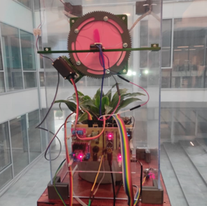
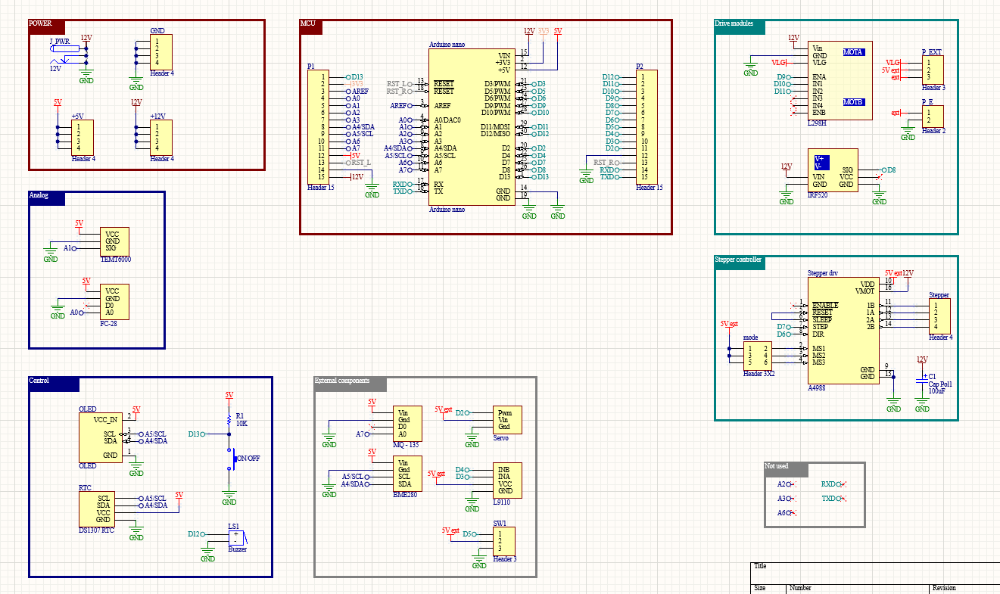
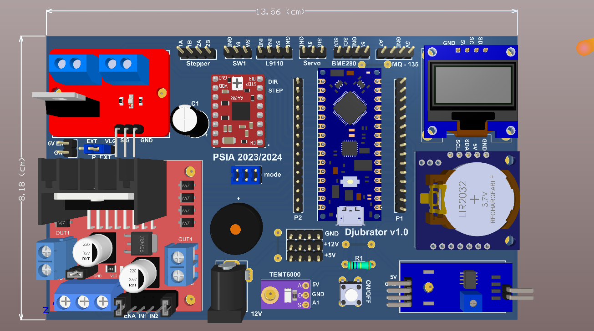
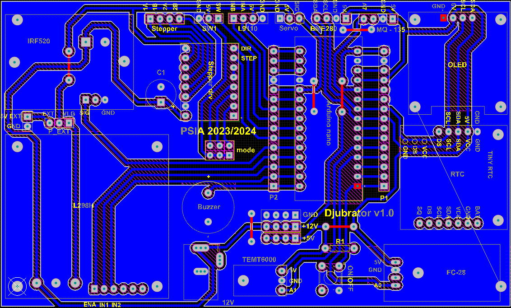

# 🌱 Smart Greenhouse Automation System

This project is a Smart Greenhouse Automation System designed to monitor environmental conditions and automatically control ventilation, irrigation, lighting, and mechanical actions.
The system is built around an Arduino Nano and a custom-designed PCB, integrating multiple sensors and actuators to maintain optimal plant-growing conditions with minimal human intervention.

  

This project was built by a group of students of Faculty of Technical Scinces

## Features

- Temperature, Humidity & Pressure Monitoring (BME280)
- Soil Moisture Measurement and automatic irrigation
- Light Intensity Detection with automatic LED control
- Ventilation System using DC motor + servo window control
- Real-Time Clock (RTC) for scheduled weekly actions
- Stepper Motor Control for periodic mechanical movement
- OLED Display for real-time data visualization
- Buzzer Alerts for system events

## System Logic

1️⃣ Environmental Monitoring

- Temperature, humidity, and pressure are read using BME280
- Soil moisture is measured via an analog soil sensor
- Light level is measured using TEMT6000
- Air quality is read via an analog gas sensor (MQ-135)

2️⃣ Automatic Actions

| Condition                | Action                       |
| ------------------------ | ---------------------------- |
| Low light                | LED grow light turns ON      |
| High temperature (>28°C) | Window opens + fan activates |
| Soil too dry             | Water pump turns ON          |
| Weekly scheduled event   | Stepper motor rotates        |
| System state change      | Audible buzzer notification  |

3️⃣ Real-Time Scheduling

- DS1307 RTC enables:
  - Time display on OLED
  - Weekly scheduled events (day + exact time)
  - Mechanical actions after defined time intervals

## Hardware components

Microcontroller
- Arduino nano

Sensors and actuators
- BME280 : Temperature, Humidity, Pressure
- TEMT6000 : Light intensity
- Soil Moisture Sensor : Analog
- MQ-135 : Air quality
- DS1307 RTC : Real-time clock
- DC Motor + L9110 Driver – Water pump / fan
- Stepper Motor + A4988 Driver
- Servo MG995 – Window opening/closing
- LED Grow Light
- Active Buzzer

## PCB Design

The system uses a custom two-layer PCB designed to:
- Integrate all sensors and drivers
- Provide stable 12V / 5V power rails
- Minimize wiring complexity
- Allow modular connections via headers

  

## PCB Highlights

- Dedicated connectors for each sensor
- Integrated motor driver mounting
- External power input (12V)
- Clean signal routing for analog sensors

  

  

  

  

## Future Improvements
- Wi-Fi (ESP32 / ESP8266) for remote monitoring
- Mobile app or web dashboard
- Data logging (SD card or cloud)

