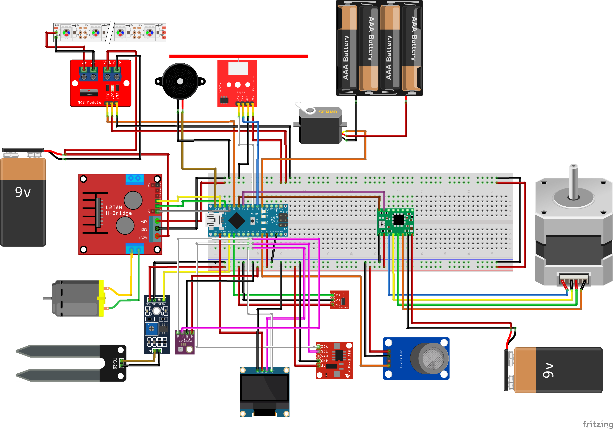

# Applications of Sensors and Actuators

Project name is "Staklenik" - "Greenhouse".

The project included a plant, and by using sensors and actuators we monitored various parameters necessary for its growth (soil moisture, temperature, pressure, etc.). With the help of actuators, the measured values could be easily adjusted.

Four teams worked on separate parts of the project during semester.
---

## Features

- BME280, MQ135, RTS clock
- Soil moisture, light level
- Servo motor, Microswitch, Buzzer, Display
- Peristaltic pump, Stepper motor, LED strip, DC motor

---

## System Preview

<table>
  <tr>
    <td align="center" colspan="2">
       
      <b>Sensor and actuators wiring</b>
    </td>
  </tr>
  <tr>
    <td align="center" colspan="2">
       
      <b>physical system realisation</b>
    </td>
  </tr>
</table>

---

## Programming

Everything was coded in C in Ardino IDE.