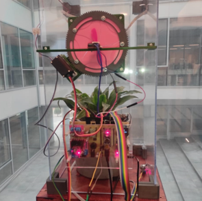
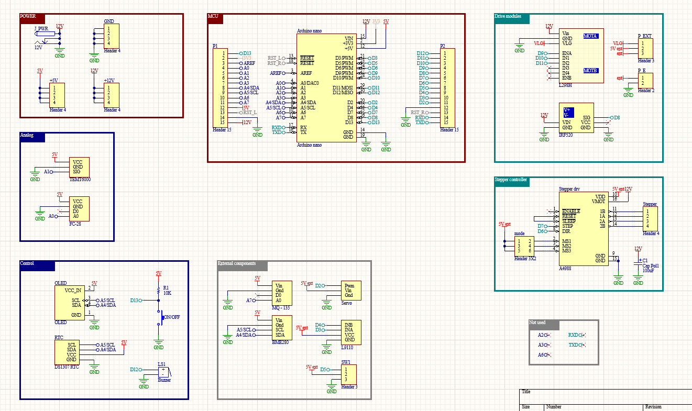
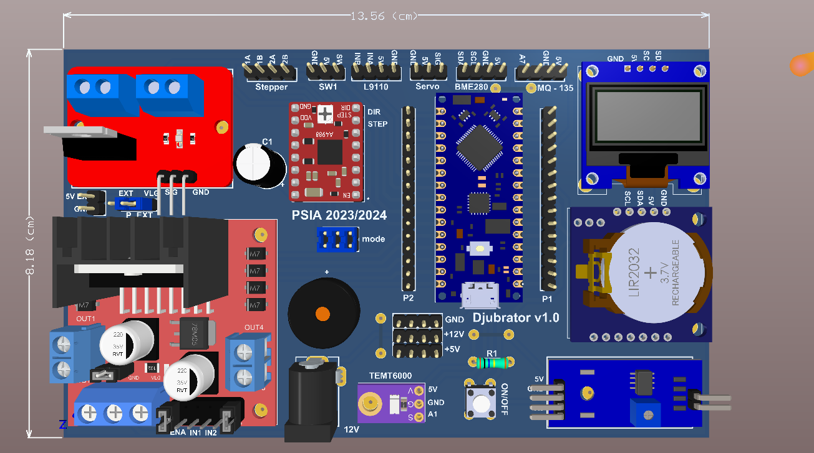
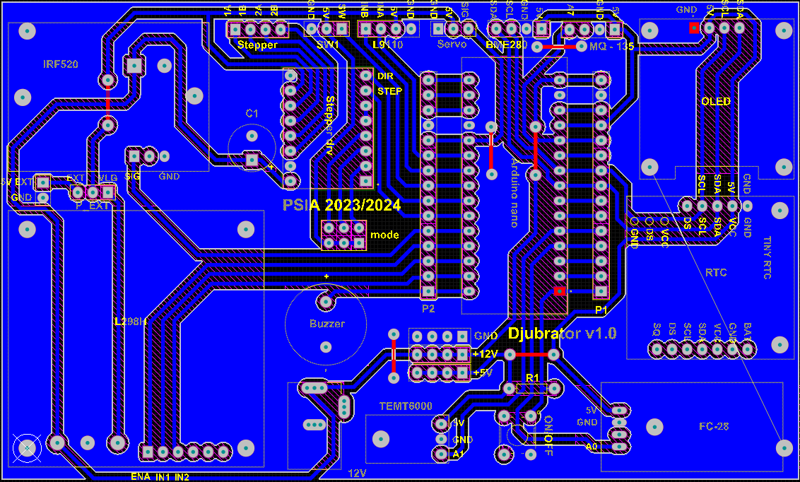

# Smart Greenhouse Automation System

Automated greenhouse that monitors environmental conditions and controls ventilation, irrigation, lighting and mechanical actions with minimal human intervention. The system is built around an **Arduino Nano** and a **custom two-layer PCB** that integrates the sensors, motor drivers and power distribution.

  

This project was developed as a **team project** by a group of students of the Faculty of Technical Sciences.

---

## Features

- Temperature, humidity and pressure monitoring (BME280)
- Soil moisture measurement with automatic irrigation
- Light intensity detection with automatic LED grow light control
- Air quality sensing (MQ-135)
- Ventilation with a DC motor fan and servo-controlled window
- Real-time clock (RTC) for weekly scheduled actions
- Stepper motor control for periodic mechanical movement
- OLED display for real-time data
- Buzzer alerts for system events

---

## System Logic

### Environmental monitoring

| Measurement | Sensor |
|---|---|
| Temperature, humidity, pressure | BME280 |
| Soil moisture | Analog soil moisture sensor |
| Light level | TEMT6000 |
| Air quality | MQ-135 (analog gas sensor) |

### Automatic actions

| Condition | Action |
|---|---|
| Low light | LED grow light turns on |
| High temperature (> 28 °C) | Window opens and fan activates |
| Soil too dry | Water pump turns on |
| Weekly scheduled event | Stepper motor rotates |
| System state change | Buzzer notification |

### Real-time scheduling

The **DS1307 RTC** enables:

- Time display on the OLED
- Weekly scheduled events (day and exact time)
- Mechanical actions after defined time intervals

---

## Hardware

| Function | Components |
|---|---|
| Microcontroller | Arduino Nano |
| Environmental sensing | BME280 (temperature, humidity, pressure), TEMT6000 (light), analog soil moisture sensor, MQ-135 (air quality) |
| Timekeeping | DS1307 RTC |
| Actuators | DC motor (water pump / fan) with L9110 driver, stepper motor with A4988 driver, MG995 servo (window), LED grow light, active buzzer |
| User interface | OLED display |

---

## PCB Design

A custom **two-layer PCB** was designed to:

- Integrate all sensors and motor drivers on one board
- Provide stable **12 V and 5 V power rails**
- Reduce wiring complexity
- Allow modular connections through headers

### PCB highlights

- Dedicated connectors for each sensor
- Integrated motor driver mounting
- External 12 V power input
- Clean signal routing for the analog sensors

  

  

  

---

## Skills Demonstrated

| Area | Details |
|---|---|
| PCB design | Custom two-layer board with 12 V / 5 V power distribution, sensor connectors, driver mounting, analog signal routing |
| System integration | Analog and digital sensors, DC, stepper and servo actuators, RTC and OLED in one system |
| Embedded firmware | Arduino Nano control logic with threshold-based automation and time-based scheduling |
| Teamwork | Hardware and software developed together in a student team |

---

## Future Improvements

- Wi-Fi (ESP32 / ESP8266) for remote monitoring
- Mobile app or web dashboard
- Data logging (SD card or cloud)