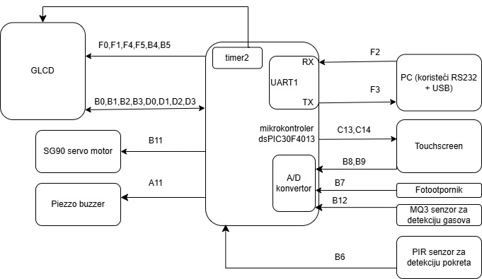
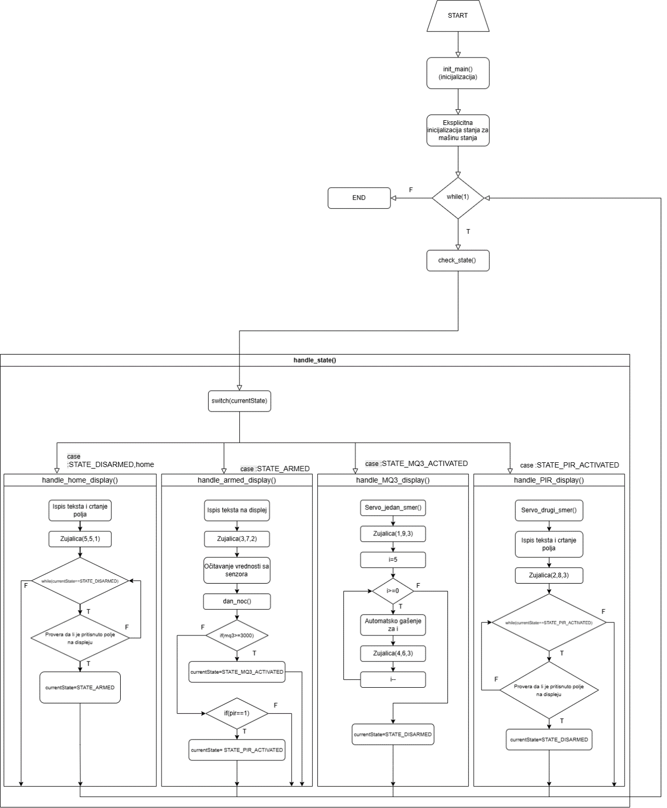

# Applied electronics project

Home security project made with various sensors and actuators.

Project was realised using dsPIC30F4013 on EasyPIC v7 dev board and programmed in MPLAB X IDE.

---

## Features

- UART(RS232)
- Buzzer, GLCD with touch pannel, Servo
- MQ3 sensor, PIR sensor, photoresistor
- Timers

---

## System Preview

<table>
  <tr>
    <td align="center">
       
      <b>Physical view of the system</b>
    </td>
    <td align="center">
       
      <b>Block scheme</b>
    </td>
  </tr>
  <tr>
    <td align="center">
             
      <b>State machine</b>
    </td>
    <td align="center">
       
      <b>Algorithm</b>
    </td>
  </tr>
</table>

---

## Programming

System was programmed in C using timers and state machine.

Sensors and actuators use digital and analog signals.

Pins used for input and output can be seen on block scheme.

---

## Demo Video

<video src="Viddeo.mp4" controls autoplay muted loop width="700"></video>