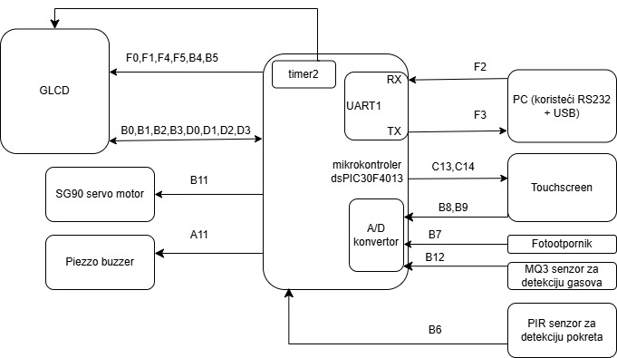
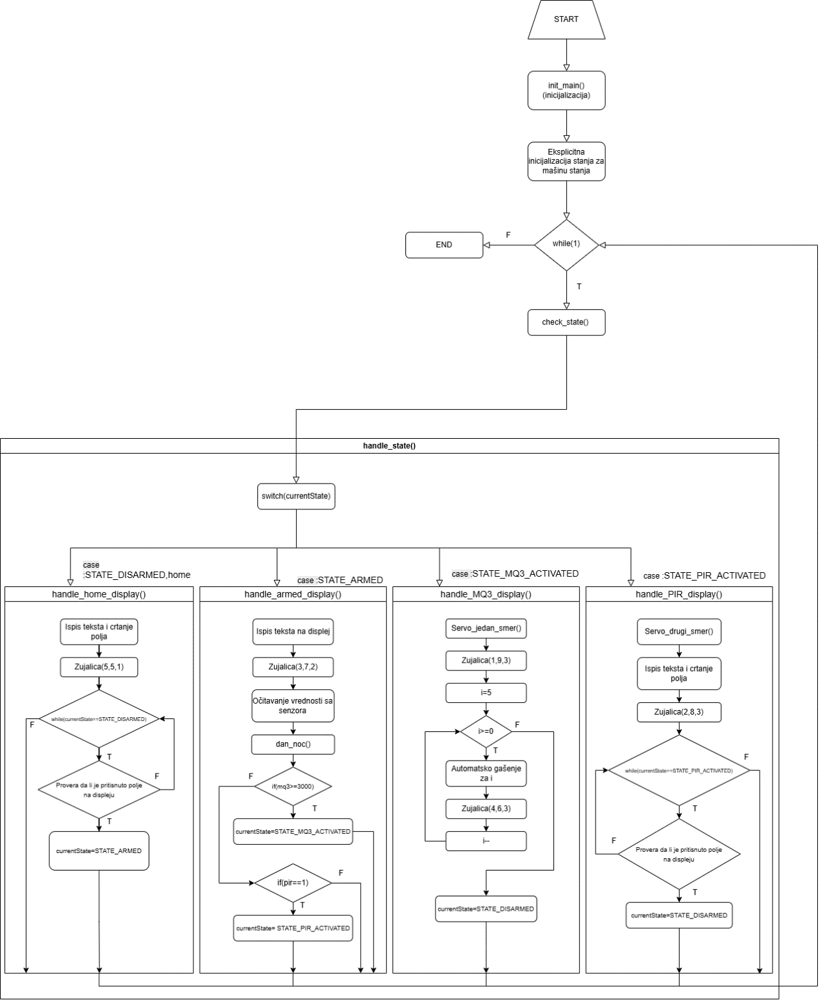

# Home Security System (dsPIC30F4013)

Home security system built around a **dsPIC30F4013** microcontroller on an **EasyPIC v7** development board. The system combines several sensors and actuators, a touch-screen graphic LCD as the user interface and an RS232 serial link. The firmware is written in **C** in **MPLAB X IDE** and structured around **timers and a state machine**.

  

---

## Features

- Home security system built from multiple sensors and actuators
- Motion detection with a **PIR sensor**
- Gas / alcohol vapor sensing with an **MQ3 sensor**
- Ambient light sensing with a **photoresistor**
- Audible signaling with a **buzzer**
- **Servo** actuator
- **Graphic LCD (GLCD) with touch panel** as the user interface
- **UART (RS232)** communication
- Timer-based task timing

---

## Hardware

| Component | Role |
|---|---|
| dsPIC30F4013 | 16-bit microcontroller (main controller) |
| EasyPIC v7 | Development board with MCU socket, GLCD connector and peripherals |
| PIR sensor | Digital input, motion detection |
| MQ3 sensor | Analog input, gas / alcohol vapor sensing |
| Photoresistor | Analog input, light level |
| Buzzer | Digital output, audible signaling |
| Servo | Actuator controlled by timer-generated signal |
| GLCD with touch panel | Display and user input |
| RS232 / UART | Serial communication |

The sensors and actuators use both **digital and analog signals**. The pins used for each input and output are shown in the block scheme below.

---

## System Design

<table>
  <tr>
    <td align="center">
       
      <b>Block scheme</b>
    </td>
    <td align="center">
       
      <b>State machine</b>
    </td>
  </tr>
  <tr>
    <td align="center" colspan="2">
       
      <b>Algorithm</b>
    </td>
  </tr>
</table>

---

## Firmware

The firmware is written in C and built around two ideas:

- **Timers** provide the time base for periodic tasks such as sensor sampling and actuator control.
- A **state machine** defines the system behavior, so each state has clearly defined inputs, outputs and transitions.

The development environment is MPLAB X IDE.

---

## Demo

[Watch the demo video](Viddeo.mp4)

---

## Skills Demonstrated

| Area | Details |
|---|---|
| Embedded C | Firmware for a 16-bit dsPIC30F microcontroller |
| Peripherals | Timers, ADC (analog sensors), digital I/O, UART |
| Sensors and actuators | PIR, MQ3, photoresistor, buzzer, servo |
| User interface | Graphic LCD with touch panel |
| Software design | State machine, timer-driven timing |
| Tools | MPLAB X IDE, EasyPIC v7 development board |