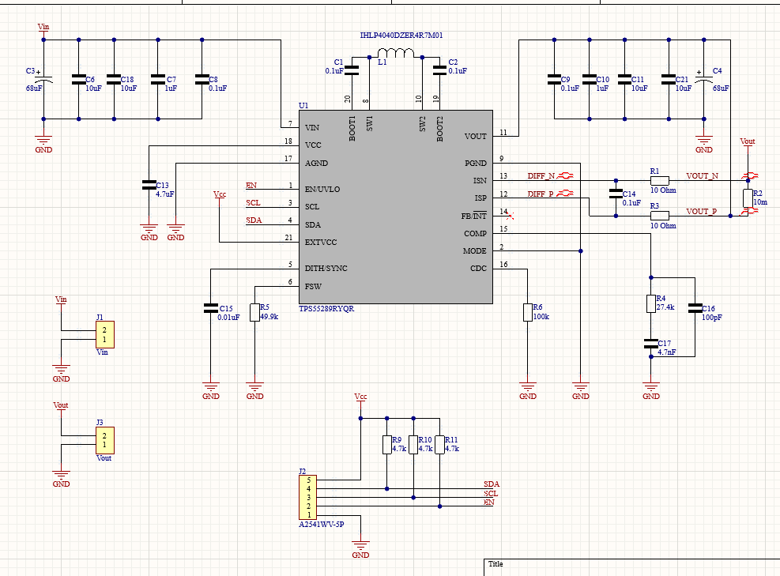

# Buck - Boost converter

Small PCB with Buck-Boost converter based on TI TSP55289 chip

---

## Features

- 3V - 30V input voltage
- 1V - 22V output voltage
- Pins for I2C communication
- 4 layer board
- 2 easy to screw header pins for input and output

---

## PCB Preview

<table>
  <tr>
    <td align="center">
       
      <b>Schematic</b>
    </td>
    <td align="center">
       
      <b>3D View</b>
    </td>
  </tr>
  <tr>
    <td align="center">
             
      <b>Top Layer</b>
    </td>
    <td align="center">
       
      <b>Bottom Layer</b>
    </td>
  </tr>
</table>

---

## Hardware
Stackup used for board was:

Signal - GND - GND - Signal

Slide switch (initially intended for changing I2C address) was removed from the top right corner to reduce production cost.
## Programing

Programming was done using basic functions for reading and writing registers.
Everything was coded in Arduino IDE using arduino nano microcontroller
