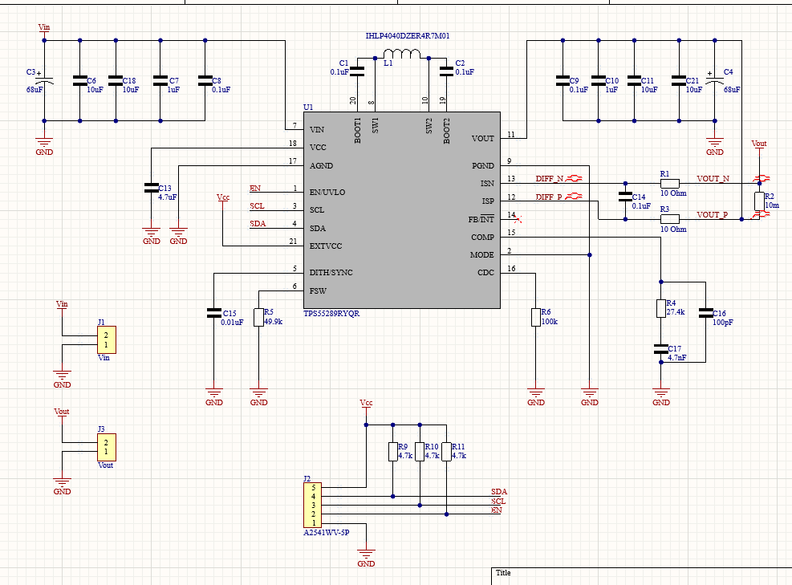

# Buck-Boost Converter (TPS55289)

Compact 4-layer buck-boost converter PCB based on the Texas Instruments **TPS55289**, with an I2C interface for setting the output voltage from a microcontroller. Designed in Altium Designer, controlled with an Arduino Nano.

<p align="center">
  
</p>

---

## Key Specifications

| Parameter | Value |
|---|---|
| Input voltage | 3 V – 30 V |
| Output voltage | 1 V – 22 V (set via I2C) |
| Max output current | 3 A |
| Board | 4 layers, size 36.8 × 36.8 mm |
| Connectors | 2 screw terminals (input, output), I2C header |

---

## Design Overview

The TPS55289 is a synchronous buck-boost converter, so it keeps regulating the output when the input is above, below or close to the output voltage. This makes the board useful as a bench power supply or as the power stage of a larger project.

**Main design decisions**

- **Inductor:** Vishay IHLP4040DZ-01, 4.7 µH (IHLP4040DZER4R7M01)
- **Output voltage setting:** programmed over I2C, so no feedback resistor changes are needed to change voltage.
- **Connectors:** screw terminals for input and output so the board can be used directly on the bench without soldering wires.

---

## PCB

### Stackup

`Signal – GND – GND – Signal`

Two inner ground planes give a low-impedance return path under the switching loop and good shielding between the two signal layers.

### Revision notes

The slide switch originally intended for selecting the I2C address was removed from the top right corner to reduce production cost.

### Gallery

<table>
  <tr>
    <td align="center">
      <br>
      <b>Schematic</b>
    </td>
    <td align="center">
      <br>
      <b>3D View</b>
    </td>
  </tr>
  <tr>
    <td align="center">
      <br>
      <b>Top Layer</b>
    </td>
    <td align="center">
      <br>
      <b>Bottom Layer</b>
    </td>
  </tr>
</table>

---

## Firmware

The converter is controlled by an **Arduino Nano** over I2C (device address `0x75`). The code uses basic register read and write functions to configure the TPS55289 (current limit, internal feedback, output voltage, enable).

Output voltage is set with an 11-bit code, `Vout = 0.8 V + code × 10 mV`:

```cpp
#include <Wire.h>

#define TPS_ADDR 0x75

void writeRegTPS(uint8_t reg, uint8_t val) {
  Wire.beginTransmission(TPS_ADDR);
  Wire.write(reg);
  Wire.write(val);
  Wire.endTransmission();
}

void setTpsVoltage(float v) {
  int code = (int)((v * 1000.0 - 800.0) / 10.0 + 0.5);
  code = constrain(code, 0, 2047);
  writeRegTPS(0x00, code & 0xFF);          // REF LSB
  writeRegTPS(0x01, (code >> 8) & 0x07);   // REF MSB
  writeRegTPS(0x06, 0xA0);                 // mode / output enable
}
```
