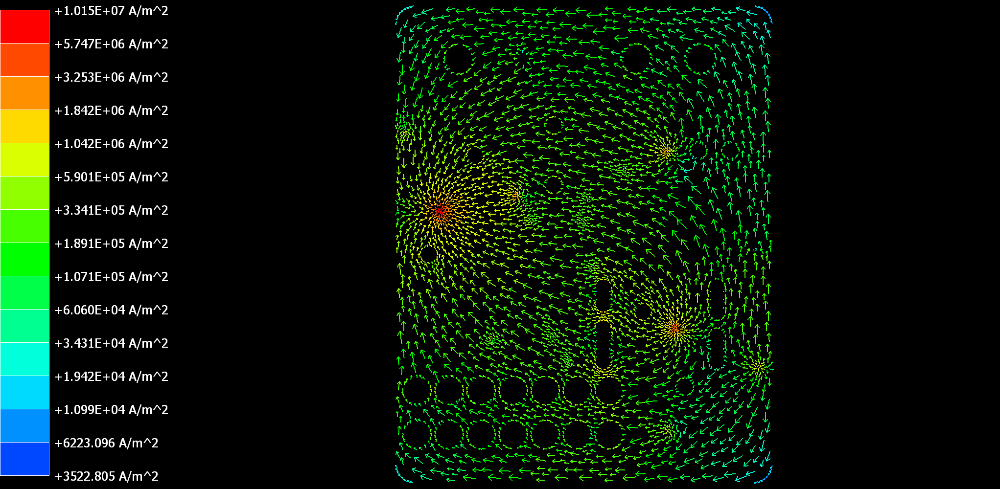

# UART communication board

UART to STM board based on ADM3202 driver.

This was a small course project mainly focused on learning Ansys SiWave simulations.

---

## Features

- ADM3202 driver.
- Small dimensions (31mm x 39mm)
- Pins for external communication with STM32F042F6P6TR
- 4 layer board
- 24V input

---

## PCB Preview

<table>
  <tr>
    <td align="center" colspan="2">
       
      <b>Schematic</b>
    </td>
  </tr>
  <tr>
    <td align="center">
             
      <b>3D view</b>
    </td>
    <td align="center">
       
      <b>Top and bottom layer</b>
    </td>
  </tr>
</table>

---
## Hardware
Stackup used for board was:

Signal - GND - GND - Signal

GND was connected from top and bottom layers using vias.

---
## Simulations

The simulations were performed in Ansys SiWave.

<table>
  <tr>
    <td align="center">
             
      <b>DC drop on 3V3 traces</b>
    </td>
    <td align="center">
       
      <b>Current on gnd1 plane</b>
    </td>
  </tr>
</table>

