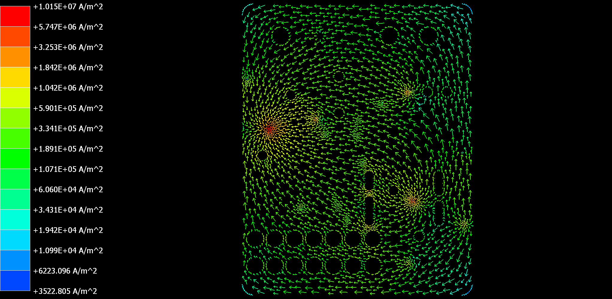

# UART–RS232 Communication Board (ADM3202)

Compact 4-layer board with an **ADM3202** RS-232 driver for serial communication with an **STM32F042F6P6TR**, powered from a 24 V input. It was a course project whose main goal was learning **power integrity simulation in Ansys SIwave**, so the board was designed and then analyzed for DC voltage drop and current distribution.

  

---

## Features

- ADM3202 RS-232 driver
- Header pins for external communication with the STM32F042F6P6TR
- 24 V input
- 4-layer PCB
- Small size: 31 mm × 39 mm

---

## Schematic

  

---

## PCB

### Stackup

`Signal – GND – GND – Signal`

The ground planes on the top and bottom layers are connected with vias.

<table>
  <tr>
    <td align="center">
       
      <b>3D view</b>
    </td>
    <td align="center">
       
      <b>Top and bottom layer</b>
    </td>
  </tr>
</table>

---

## Simulations (Ansys SIwave)

The board was analyzed in **Ansys SIwave** to check the power distribution and the ground return paths.

<table>
  <tr>
    <td align="center">
       
      <b>DC drop on 3V3 traces</b>
    </td>
    <td align="center">
       
      <b>Current on GND1 plane</b>
    </td>
  </tr>
</table>

- **DC drop analysis** shows the voltage loss along the 3.3 V traces.
- **Current distribution** on the first ground plane shows where the return current flows.

---

## Skills Demonstrated

| Area | Details |
|---|---|
| PCB design | 4-layer board, Signal–GND–GND–Signal stackup, GND via connections |
| Power integrity | DC voltage drop and plane current analysis in Ansys SIwave |
| Interfaces | RS-232 level conversion with ADM3202, connection to an STM32 |