# OhmSprint – AC Voltage and Current Measurement Board

Measurement board built for the **OhmSprint** competition. It measures a **7 V AC input** and the **current through a load** using the **ATM90E26** metering IC, processes the data on an STM32 microcontroller and shows the results on an LCD display. First designed in **KiCad**, then fully **redesigned in Altium Designer** to fix routing and power distribution problems of the original board.

  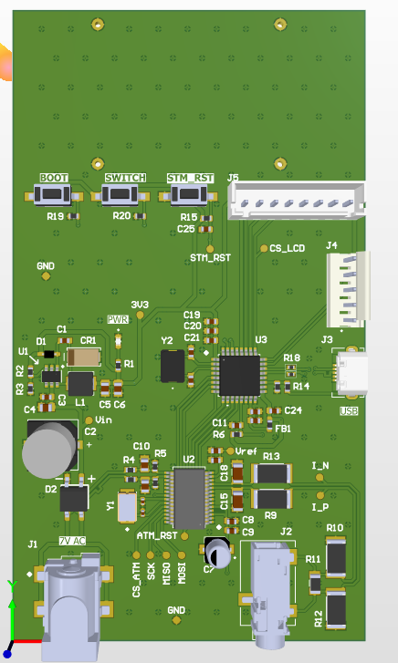

---

## Competition Task

The task was to design a measurement system whose inputs are a **7 V AC signal** and the **current flowing through the measured load**. The signals had to be acquired and processed with the **ATM90E26** measurement IC. Everything else (power supply, communication interfaces, microcontroller and supporting circuitry) was left to the competitor, and so was the way the measured data is processed and presented.

---

## System Overview

| Block | Implementation |
|---|---|
| Measurement IC | ATM90E26 (AC voltage, current, frequency and power measurement) |
| Voltage input | 7 V AC, resistor dividers feeding differentially routed voltfage channel inputs |
| Current input | Dedicated current channel with burden and filtering network |
| Power supply | Full Graetz bridge rectifier from the AC input, followed by an MCP16301 buck regulator producing 3.3 V |
| Microcontroller | STM32G431K6T6 |
| Interfaces | SPI between the MCU and ATM90E26, USB for data transfer, SWD for programming |
| Display | LCD mounted on the board with four mounting holes |

---

## Original Design (KiCad)

The first version of the board was designed in **KiCad**. An **LCD display** was chosen for presenting the measured data, so four mounting holes were placed on the upper side of the PCB for mounting the display.

  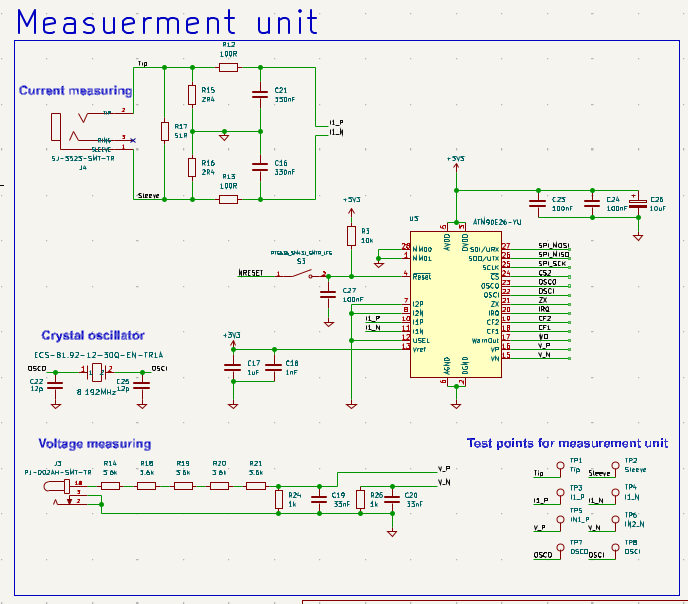
  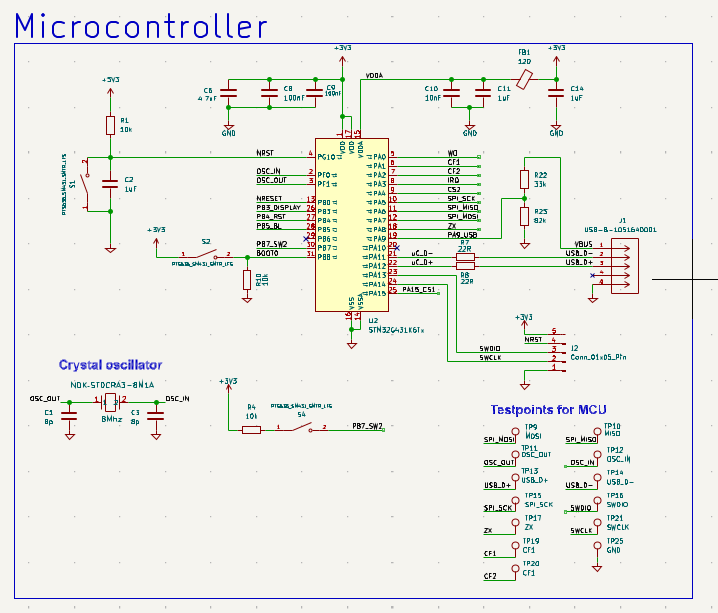

  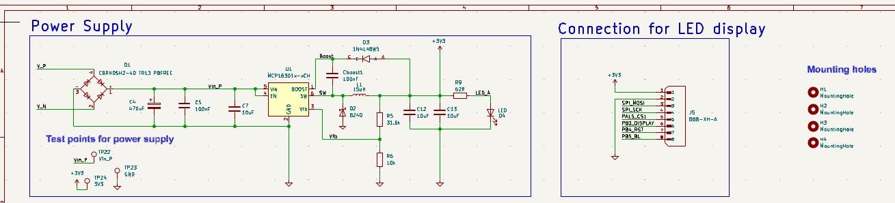

### Original PCB

  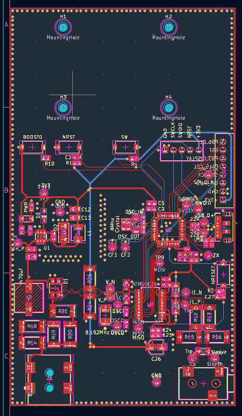
  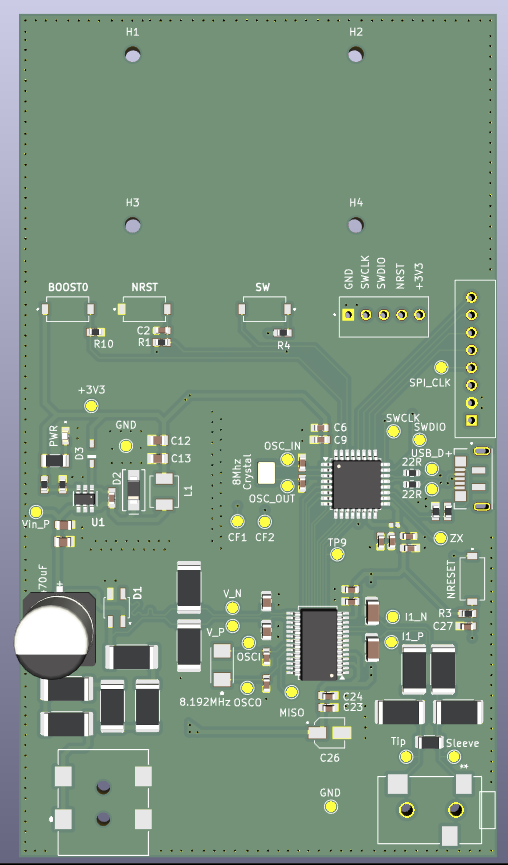

---

## Altium Designer Redesign

The design was redone in **Altium Designer** to address problems found in the original board, mainly **routing issues and errors in the power distribution**. The component placement and the overall architecture were kept similar to the original, so the work focused on improving the implementation instead of changing the concept.

### Main Improvements

- Schematic recreated and corrected
- Component footprints redesigned and corrected
- 3D models created and corrected for the components
- Overall PCB routing improved
- Power routing and power distribution improved
- GND planes used more effectively to give proper current return paths
- GND via stitching improved
- Differential-pair routing corrected and optimized
- Unnecessary test points removed

### Redesigned Schematic

  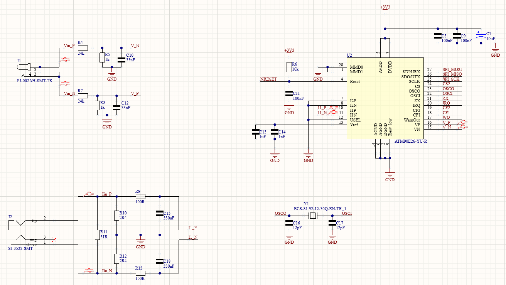
  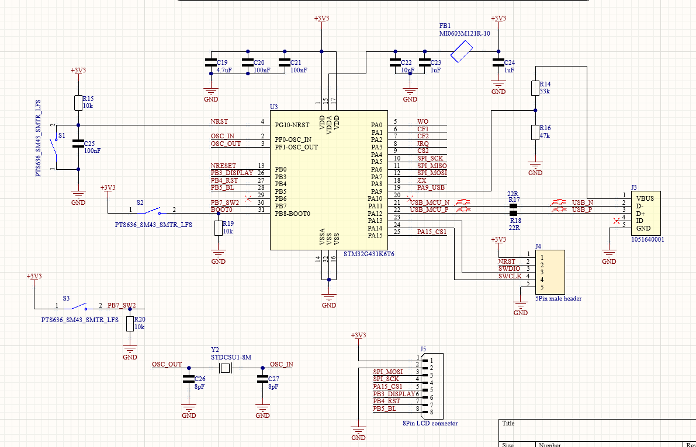

  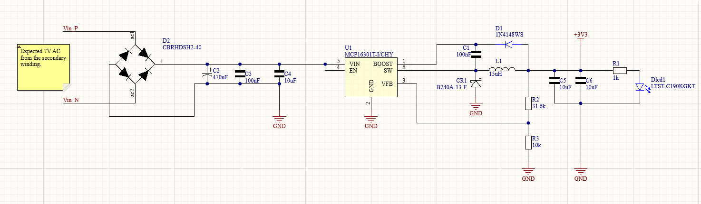

### PCB Layout

The layout was redesigned with particular attention to power distribution, current return paths, differential routing and overall routing quality.

  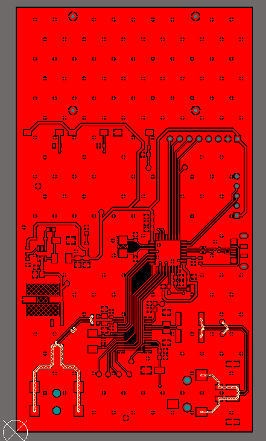
  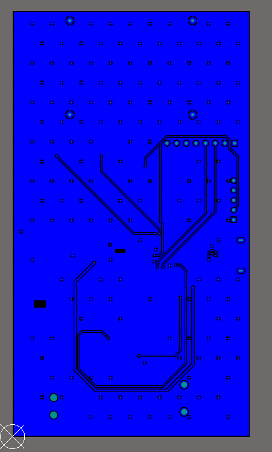

  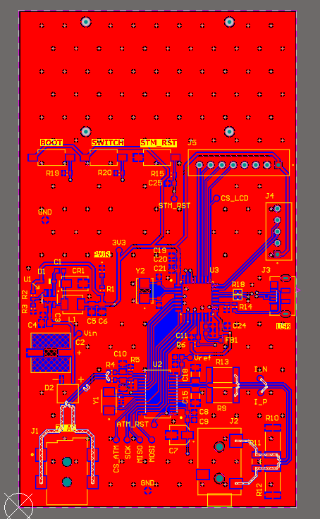
  

---

## Skills Demonstrated

| Area | Details |
|---|---|
| Design tools | Altium Designer (schematic capture, PCB layout, design rules, 3D verification), KiCad |
| PCB design | Component placement, power distribution, ground planes, GND via stitching, differential-pair routing, trace width and clearance, stack-up |
| Library work | Footprint creation and modification, 3D model creation |
| Mixed-signal measurement | AC voltage and current sensing with the ATM90E26, analog front-end design, separation of power and measurement circuitry |
| Interfaces | SPI, USB, SWD |
| Design review | Analysis of an existing design, finding errors and redesigning it |

---

## Project Status

**Completed.** Both the analysis of the original design and the redesigned schematic and PCB in Altium Designer are finished.